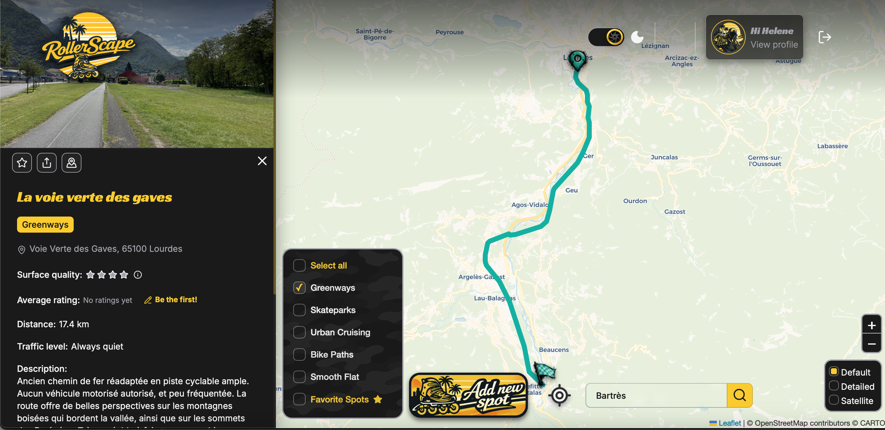
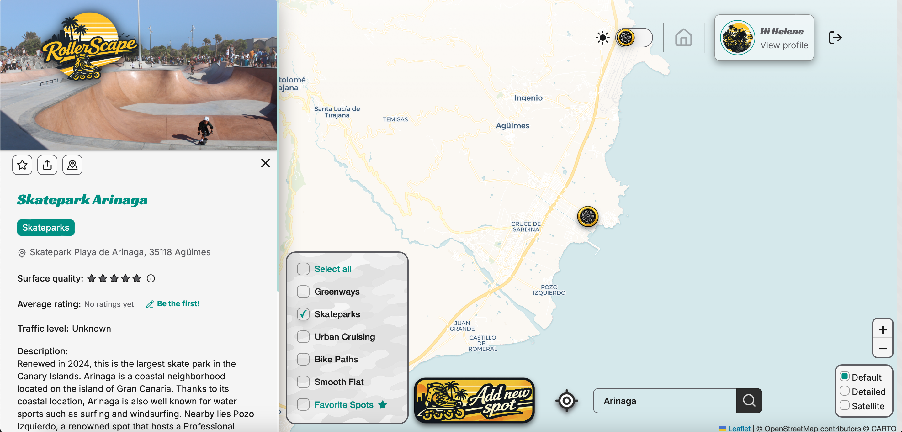

# RollerScape

<div align="center">

**Community-driven map for inline skaters to help them discover, share, and navigate rollerblading spots near them.**

[](https://reactjs.org/)
[](https://www.typescriptlang.org/)
[](https://supabase.com/)

</div>

---
## About

Built as the final project for the **IT Academy** full-stack bootcamp by **Barcelona Activa**. The idea came from a simple frustration: finding new rollerblading routes you can do with your dog is surprisingly hard. No dedicated platform exists for skaters to share and discover spots tailored to their style and practice — so I built one.

---

## Features

### 🗺️ Map & Spot Discovery
Browse rollerblading spots without signing up:

- **Location search bar** — Jump instantly to any city, town, or country without dragging the map across continents
- **Filter by spot type** — Greenways, bike paths, skateparks, street plazas...
- **Spot info panel** — Tap any spot to expand its details: surface type, difficulty, photos, ratings, and community comments
- **Route preview** — For itinerary-type spots, visualize the full route directly on the map
- **Dark/Light theme** — Switch between themes to suit your environment or preference

### 📍 Spot Submission
Contribute to the map whether you're adding a single location or a full skating route:

#### Point Spots
- **Click on the map** to pin the exact location and capture coordinates automatically, or...
- **Paste a Google Maps link** and let the app extract the coordinates for you

#### Routes
- **Pin start & end points** on the map — OSRM will suggest route options
- **Draw a custom route** by hand directly on the map
- **Upload a GPX file**

Once your location or route is set, fill in name, spot type, skating style, difficulty, description, and optional photos — displayed in a gallery inside the spot panel.

### 🧭 Navigation & Sharing
- **Share a spot** — Native share sheet via the Web Share API (`navigator.share`)
- **Open in navigation** — Detects iOS vs Android and opens the correct deep link (`maps://` for Apple Maps, `google.com/maps` for Google Maps)
- **Locate me** — Centers the map on your current position via the Geolocation API

### 👤 User Profile
- **Favorites** — All your saved spots in one place
- **Submitted spots** — Manage and edit your contributions
- **Reviews** — Your rating and comment history
- **Skating profile** — Set your level and style; displayed on your comments and spot submissions so other skaters can gauge if a spot or review matches their own practice

### 🔐 Authentication & Personalization
- **Register / Login** — Email/password or Google OAuth via Supabase Auth
- **Protected routes** — Certain features (such as adding spots) are only accessible to registered users
- **Personalized map** — Spots are pre-filtered based on your skating profile so the map is relevant to you from the moment you log in


## Preview


1. **Desktop view**:





2. **Mobile view**:


---

## Quick Start

1. Clone the repository
```bash
   git clone https://github.com/H3llynx/rollerscape.git
```

2. Install dependencies
```bash
   npm install
```

3. Set up environment variables
   Create a `.env` file in the root directory:
```
  VITE_SUPABASE_URL=your_supabase_url
  VITE_SUPABASE_PUBLISHABLE_DEFAULT_KEY=your_publishable_default_key
```

4. Run the development server
```bash
   npm run dev
```

---

## 📁 Project Structure
```
9.rollerscape/
┣ 📂 src/
┃  ┣ 📂 assets/           # Images and SVGs
┃  ┣ 📂 components/       # Shared UI components
┃  ┣ 📂 config/           # urls, databases variables, error messages, etc...
┃  ┣ 📂 features/         # Feature-based modules
┃  ┣ 📂 router/           # Route configuration & ProtectedRoute
┃  ┣ 📂 services/         # Reusable data fetch and management functions
┃  ┣ 📂 styles/           # Shared CSS
┃  ┣ 📂 test/             # Vitest setup file
┃  ┣ 📂 types/            # Shared types classified by function (geolocation, spot, user...)
┃  ┣ 📂 utils/            # Shared helper functions
┃  ┣ 📄 App.tsx
┃  ┣ 📄 global.d.ts       # Necessary for Swiper imports
┃  ┗ 📄 main.tsx
┣ 📄 vite.config.ts       
┣ 📄 tsconfig.json        
┗ 📄 package.json
```
---

## Tech Stack

| Layer | Tech |
|---|---|
| **Frontend** | React, TypeScript, Tailwind CSS |
| **Backend** | Supabase (PostgreSQL + Auth) |
| **Routing** | React Router |
| **Authentication** | Supabase Auth — Email/Password & Google OAuth |
| **Build Tool** | Vite |
| **Testing** | Vitest |

### APIs & Services

| Name | Usage |
|---|---|
| **OSRM** | Route suggestions for itinerary-type spots |
| **Nominatim** | Location search bar & reverse geocoding for friendly addresses |
| **imgBB** | Photo hosting |
| **Geolocation API** | Browser-native — detects user position to center the map |
| **Web Share API** | Browser-native (`navigator.share`)

### Libraries

| Name | Usage |
|---|---|
| **react-leaflet** | Interactive map |
| **React Hook Form** | Form handling |
| **Swiper** | Fullscreen photo lightbox — click any image in the panel to open it in a swipeable dialog |
| **Lucide** | Icons |
| **Tailwind Variants** + **tailwind-merge** | Variant-based component styling & class conflict resolution |
| **react-responsive** | `useMediaQuery` hook for responsive logic |

### Other
- GPX file import for custom route contributions
- Fully responsive — optimized for both mobile and desktop, full viewport layout

---

## 🧪 Testing
```bash

npm run test

```
or
```bash

npm run test:ui

```
---

<div align="center">

Made with 💙 by [H3llynx](https://github.com/H3llynx)

</div>